# Walmart Sales Data Analyst
Walmart sales analyst 2010-2012 focusing in unemployment and fuel price impact

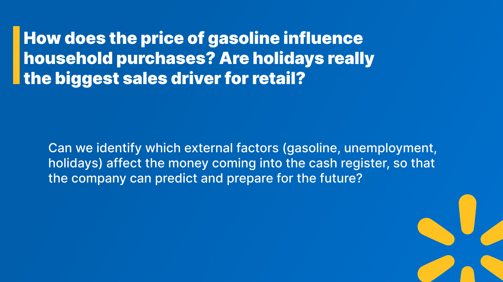
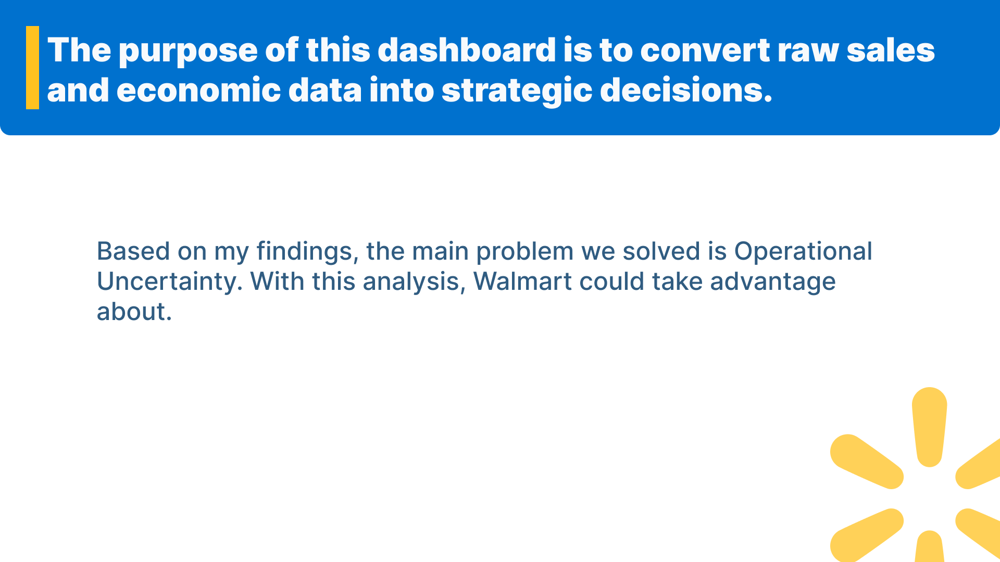
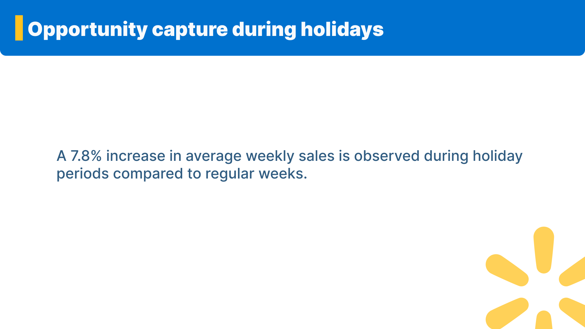
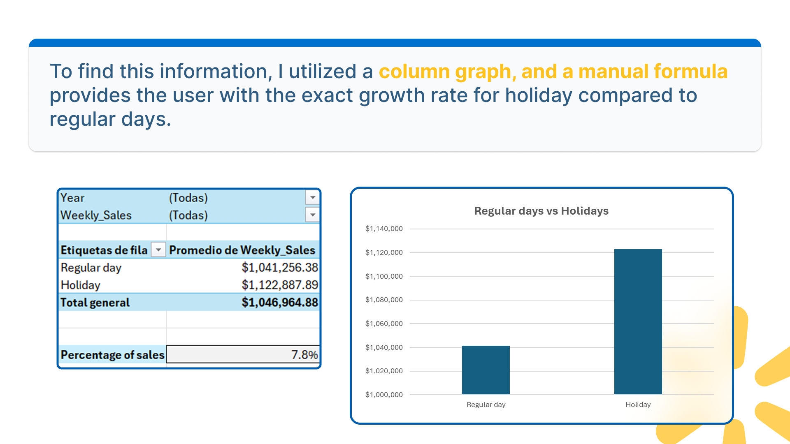
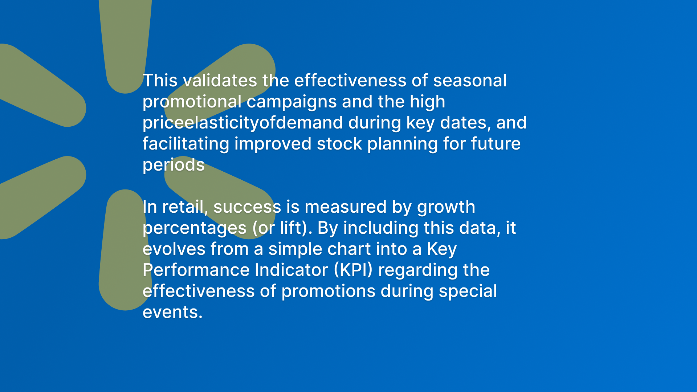
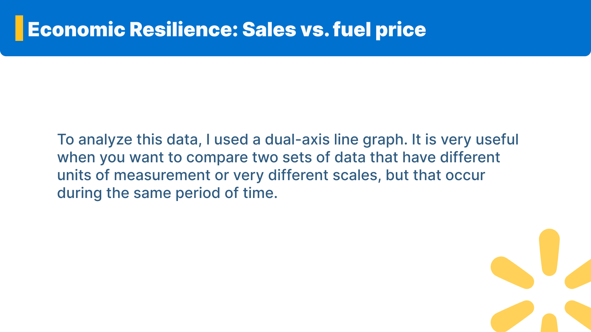
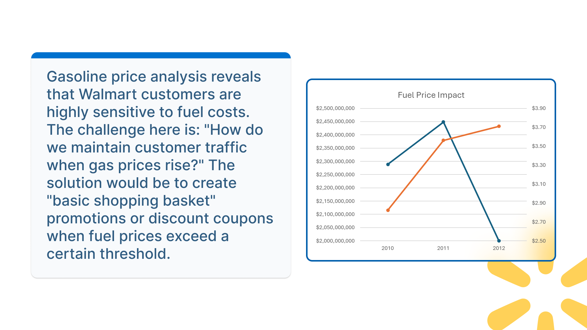
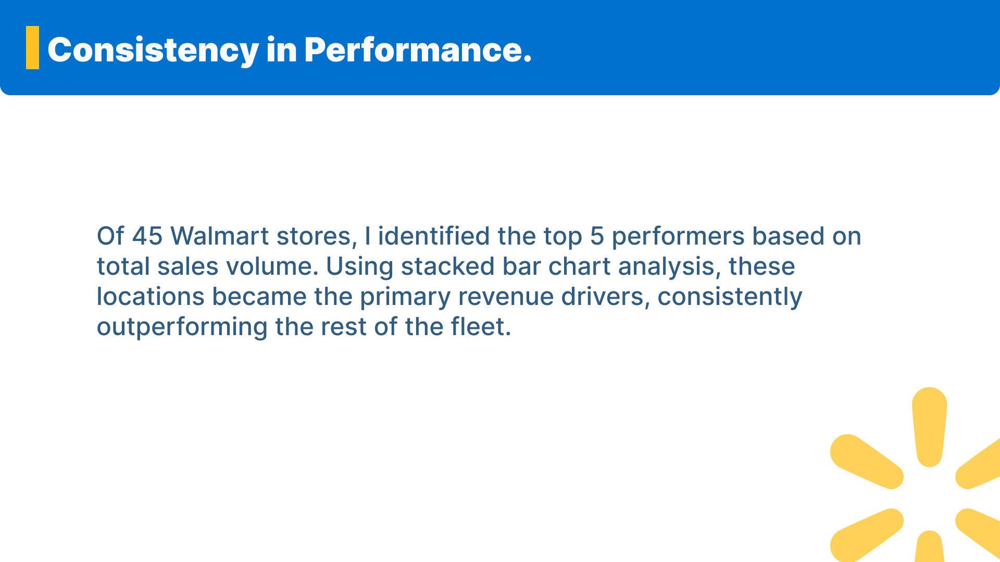
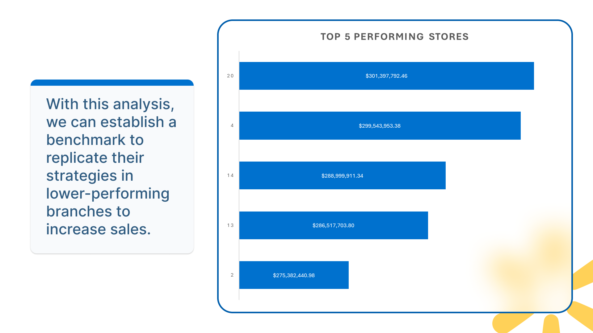
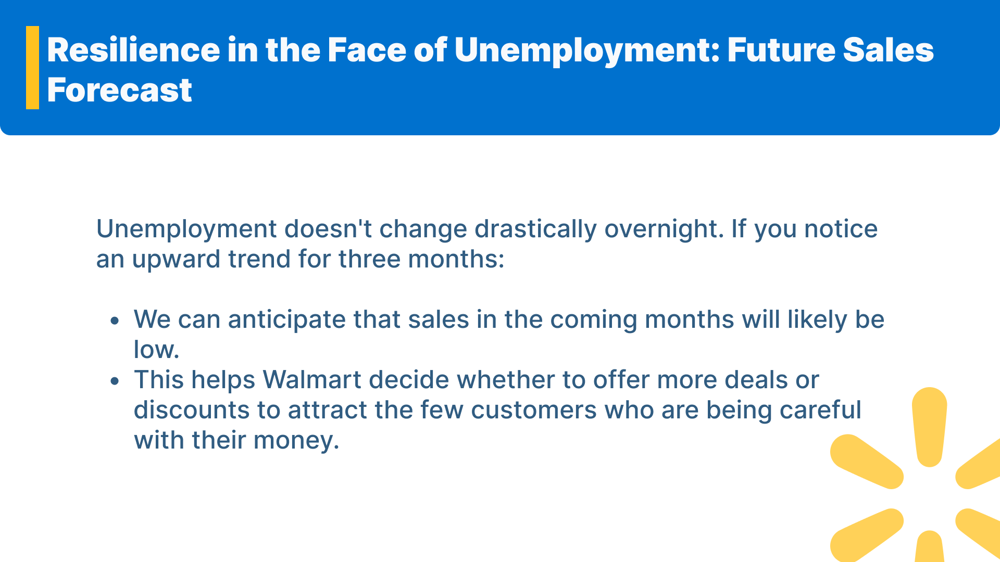
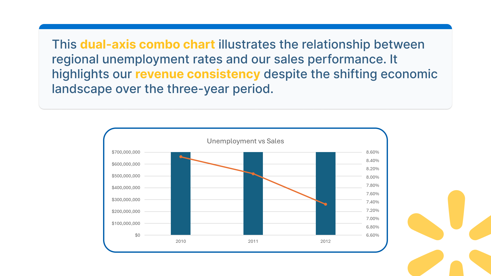

You can download all the documents here [Data](https://github.com/brenmartinez1999/Walmart-Sales-Data-Analyst/tree/main/Data) or you can check the Dashboard directly here: [Dashboard](https://1drv.ms/x/c/9ef31bce3287aae0/IQBAn54aPIO-TZaXcWZwxQuaAegBmzgJClBRrgVqc1kPYrU?e=nHfG00)
